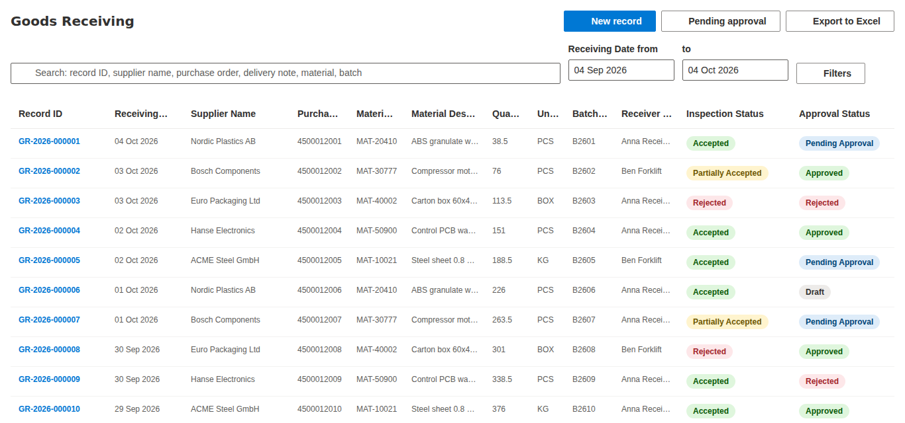
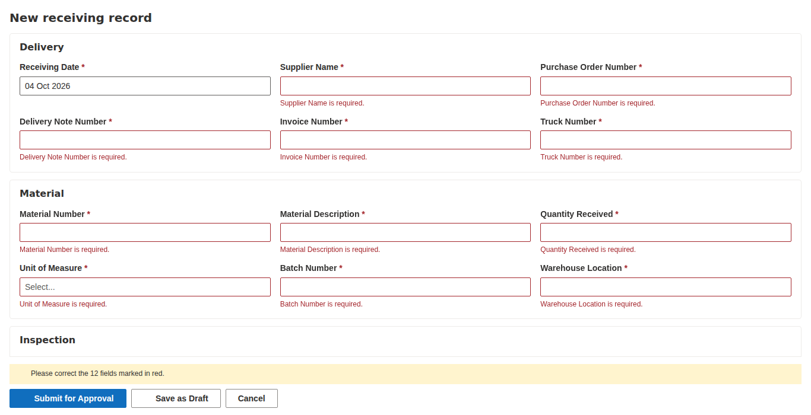
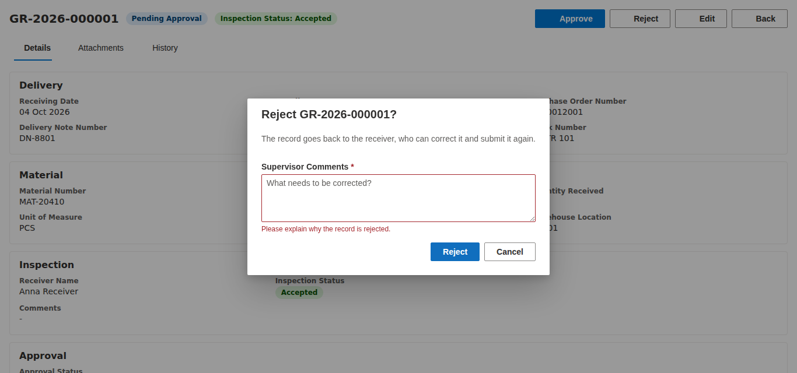
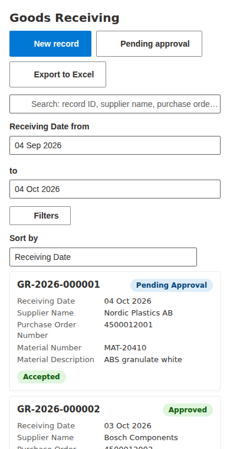
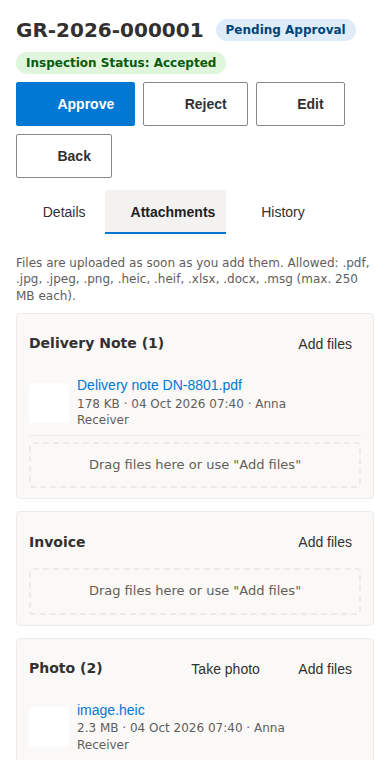

# Goods Receiving web part

A SharePoint Framework (SPFx) web part for the warehouse team. They use it to record incoming
material shipments, attach delivery notes, invoices, photos and inspection documents, and send
each record to a supervisor for approval.

- Users sign in with their normal Microsoft 365 accounts. There is no separate login and no external server.
- Records are stored in the SharePoint list **Material Receiving Records**.
- Files are stored in the document library **Receiving Documents**.
- Everything about the fields is driven by **one configuration file**: `src/config/fields.json`.

> **For IT / deployment:** see [DEPLOYMENT.md](./DEPLOYMENT.md).

| Record list | New record (validation) | Approve / reject |
|---|---|---|
|  |  |  |

| Phone: record list | Phone: attachments |
|---|---|
|  |  |

*Screenshots use sample data. Icons are missing in them because the screenshot tool could not
load Microsoft's icon font. They appear normally in SharePoint.*

---

## Contents

1. [Features](#features)
2. [Technology and versions](#technology-and-versions)
3. [Folder structure](#folder-structure)
4. [Setup](#setup)
5. [Configuration](#configuration)
6. [Provisioning the SharePoint list, library and groups](#provisioning-the-sharepoint-list-library-and-groups)
7. [Running locally (SharePoint workbench)](#running-locally-sharepoint-workbench)
8. [Building the package](#building-the-package)
9. [How to add a new field (step by step)](#how-to-add-a-new-field-step-by-step)
10. [Approval workflow and roles](#approval-workflow-and-roles)
11. [Security model: what the app enforces and how to make it stricter](#security-model-what-the-app-enforces-and-how-to-make-it-stricter)
12. [Large lists (more than 5,000 records)](#large-lists-more-than-5000-records)
13. [Troubleshooting](#troubleshooting)
14. [Known limitations](#known-limitations)

---

## Features

### Record list (home screen)

- Server-side paging: SharePoint returns 25 records per page (configurable). Records are never all loaded at once.
- Search across Record ID, supplier, purchase order number, delivery note number, material number and batch number.
  Typing a full Record ID (for example `GR-2026-000123`) opens that record directly.
- Filters:
  - Receiving date range, defaulting to the last 30 days.
  - A filter panel for supplier, inspection status, approval status and receiver.
- Active filters are shown as removable chips.
- Sortable columns, and coloured badges for inspection and approval status.
- **Pending approval** quick view for supervisors (`#gr/pending`), oldest records first.
- **Export to Excel**: exports *all* records matching the current search and filters, not only the
  visible page. Headers are readable and dates are real Excel dates.
- On phones, the table becomes tappable cards and a "Sort by" selector appears.

### New / edit record form

- Generated from `fields.json`: sections, field types, required markers and help texts.
- **Save as Draft** only needs Receiving Date, Supplier Name and Purchase Order Number.
  **Submit for Approval** needs every required field.
- Conditional rules:
  - Comments are required when Inspection Status is Rejected or Partially Accepted.
  - Quantity must be greater than 0.
  - Maximum lengths.
- A clear message appears under each field with a problem, and the form scrolls to the first one.
- Receiving Date defaults to today and Receiver Name defaults to the current user.
- Warns before you leave the page with unsaved changes.

### Record detail view

- Shows all fields, including Record ID, Created By/Date and Modified By/Date.
- An **Attachments** tab, with files grouped by Delivery Note, Invoice, Photo and Inspection Document.
- A **History** tab listing who changed which field, from what to what, and when. It comes from SharePoint version history.
- **Approve** and **Reject** buttons for supervisors. Rejecting requires a supervisor comment.

### Attachments

- Drag and drop, a file picker per category, and **Take photo**, which opens the camera on phones and tablets.
- Allowed types: PDF, JPG/JPEG, PNG, HEIC/HEIF, XLSX, DOCX, MSG. Maximum 250 MB per file (configurable).
- Large files are uploaded in chunks, with a progress bar.
- Each record gets its own folder in the library, named after its Record ID. Every file is
  linked to its record (lookup column) and tagged with a document type.
- Files can be previewed in SharePoint's viewer or downloaded. They can be deleted (moved to the
  recycle bin) only while the record is editable.

---

## Technology and versions

| | Version | Notes |
|---|---|---|
| SharePoint Framework | **1.23.2** | Latest stable release. Uses the new **Heft** build tool, not gulp. |
| Node.js | **22.14 or newer, below 23** | Node 20 and Node 24 do **not** work with SPFx 1.23. |
| React | 17.0.1 | Fixed by SPFx. |
| Fluent UI | 8.x (`@fluentui/react`) | The version SharePoint itself uses. |
| PnPjs | 4.21 (`@pnp/sp`) | All SharePoint REST access. |
| write-excel-file | 4.1 | Creates the .xlsx file in the browser. Loaded only when Export is clicked. |
| TypeScript | 5.8 | |
| PnP.PowerShell | 2.12 or newer (3.x recommended) | Only for the provisioning script. Needs PowerShell 7.2+ (7.4+ for PnP.PowerShell 3). |

**Check your Node.js version** with `node -v`. If it does not start with `v22.`, install Node 22 LTS:

- **Windows:** install [nvm-windows](https://github.com/coreybutler/nvm-windows), then run `nvm install 22` and `nvm use 22`.
- **macOS / Linux:** install [nvm](https://github.com/nvm-sh/nvm), then run `nvm install 22` and `nvm use 22`.

**Why write-excel-file instead of SheetJS?** The copy of SheetJS on npm (`xlsx` 0.18.5) is old and
is flagged by `npm audit` for two security issues. Current SheetJS versions are only published on
SheetJS's own CDN, which many corporate networks block. `write-excel-file` is MIT-licensed,
maintained, has one small dependency, and supports what we need: bold headers, date formats,
column widths and a frozen header row.

---

## Folder structure

```
goods-receiving/
├── config/                       SPFx build settings (package-solution.json, serve.json, ...)
├── docs/screenshots/
├── provisioning/
│   └── Provision-GoodsReceiving.ps1   creates list, library, columns, indexes, groups
├── src/
│   ├── config/
│   │   ├── fields.json           ★ ALL record fields (the one file to edit for new fields)
│   │   ├── fields.schema.json    makes VS Code validate fields.json and show help texts
│   │   ├── solution.json         list/library/group names, document types, list view, export
│   │   ├── solution.schema.json
│   │   ├── appConfig.ts          loads and checks the configuration at startup
│   │   └── fieldKeys.ts          the few field keys the workflow logic depends on
│   ├── models/                   TypeScript types (records, users, attachments, errors)
│   ├── logic/                    pure business rules, no SharePoint calls
│   │   ├── validation.ts         required / conditional / format rules
│   │   ├── workflow.ts           who may edit, submit, approve; status transitions
│   │   ├── caml.ts               SharePoint query builder (index-friendly)
│   │   ├── recordId.ts           GR-YYYY-000001 format
│   │   ├── versionDiff.ts        version history -> "field X changed from A to B"
│   │   └── dates.ts, format.ts, files.ts
│   ├── services/                 data access layer (the only code that talks to SharePoint)
│   │   ├── ReceivingRecordService.ts
│   │   ├── AttachmentService.ts
│   │   ├── UserService.ts
│   │   ├── ExportService.ts
│   │   ├── fieldMapping.ts       SharePoint JSON <-> record values, driven by fields.json
│   │   └── errors.ts             turns technical errors into user-friendly messages
│   ├── test/                     Jest unit tests (51 tests)
│   └── webparts/goodsReceiving/
│       ├── GoodsReceivingWebPart.ts   web part entry point + settings pane
│       └── components/                React UI (list/, form/, detail/, attachments/, common/)
└── package.json
```

---

## Setup

```bash
cd goods-receiving
npm install
```

The first install downloads about 1,300 packages, which takes a few minutes. `npm install` may
print deprecation and audit warnings that come from Microsoft's SPFx build tools. They do not
affect the web part that runs in the browser.

---

## Configuration

### 1. Fields: `src/config/fields.json`

Each entry describes one field. Example:

```json
{
  "key": "batchNumber",
  "internalName": "BatchNumber",
  "displayName": "Batch Number",
  "type": "Text",
  "required": true,
  "validation": { "maxLength": 50 },
  "indexed": true,
  "order": 120,
  "section": "material",
  "showInTable": true,
  "includeInExport": true,
  "searchable": true,
  "sortable": true,
  "tableWidth": 90
}
```

| Property | Meaning |
|---|---|
| `key` | Name used inside the app (camelCase). Never change it after go-live. |
| `internalName` | SharePoint column name: letters and digits, no spaces. Never change it after the column exists. |
| `displayName` | Label in the form, table header and Excel header. Can be changed any time. |
| `type` | `Text`, `Note` (multi-line), `Number`, `Date`, `DateTime`, `Choice`, `User` (person), `Lookup`. |
| `required` | Required when the record is **submitted** for approval. |
| `requiredForDraft` | Also required for **Save as Draft**. Also marked required in SharePoint. |
| `requiredWhen` | Required only when another field has certain values, e.g. `{ "field": "inspectionStatus", "in": ["Rejected"] }`. |
| `choices` | Values for `Choice` fields. |
| `badgeTones` | Shows the value as a coloured badge: `neutral`, `info`, `success`, `warning`, `danger`. |
| `defaultValue` | Value for new records. `[today]` for dates, `[me]` for person fields. |
| `validation` | `min`, `max`, `minExclusive` (greater than), `maxExclusive`, `integer`, `maxLength`, `pattern` + `patternMessage`. |
| `decimals` | Decimal places for numbers. |
| `order` | Position in the form, table, detail view and Excel export. |
| `section` | Form section (`delivery`, `material`, `inspection`, ... defined at the top of the file). |
| `showInForm` / `showInDetail` | Show in the form / detail view (default: yes, except read-only fields in the form). |
| `showInTable` / `includeInExport` | Column in the record list / column in the Excel file. |
| `filterable`, `searchable`, `sortable` | Offer a filter / include in free-text search (Text only) / allow sorting. |
| `indexed` | Create a SharePoint index (needed for filtering large lists; maximum 20 per list). |
| `readOnly`, `builtIn` | Set by the app or by SharePoint (Record ID, Approval Status, Created, ...). |
| `lookup` | For `Lookup` fields: `{ "listTitle": "Suppliers", "showField": "Title" }`. |

Open the file in **Visual Studio Code**. Thanks to `fields.schema.json` it underlines mistakes and
shows these explanations when you hover over a property. The app also checks the configuration
when it starts, and shows a clear error if something is wrong (for example a duplicate key).

### 2. Names and settings: `src/config/solution.json`

| Section | What you can change |
|---|---|
| `list` / `library` | Titles and URLs of the list and library, version limit. |
| `library.documentTypes` | Attachment categories. `photoDocumentType` is the one used by "Take photo". |
| `library.allowedExtensions`, `maxFileSizeMB` | Allowed file types and size. |
| `groups` | Names of the two SharePoint groups and of the supervisors' permission level. |
| `recordId` | Prefix (`GR`) and number of digits (6). |
| `listView` | Date field used for the default date range, default range in days, page size, default sort. |
| `export` | Maximum rows per export (10,000), file name prefix, sheet name. |

### 3. Web part settings (on the SharePoint page)

Edit the page, select the web part and click the pencil icon:

- **Records list / Documents library:** only needed if you renamed them.
- **Site URL:** only if the list and library live on a different site than the page.
- **Default date range:** how many days back the record list shows by default (default 30).
- **Records per page:** 10, 25, 50 or 100.

---

## Provisioning the SharePoint list, library and groups

The script `provisioning/Provision-GoodsReceiving.ps1` reads `fields.json` and `solution.json` and creates:

- The list **Material Receiving Records**:
  - all columns, with **Title renamed to "Record ID"**
  - indexes on Receiving Date, Supplier Name, Purchase Order Number, Material Number, Batch Number,
    Inspection Status, Approval Status, plus Record ID and Receiver Name
  - **version history** (500 versions), list item attachments switched off, grid editing switched off
  - a column validation rule so Quantity Received must be greater than 0, even when someone edits the list directly
- The library **Receiving Documents**:
  - a **Record ID** lookup column (indexed) and a **Document Type** choice column
  - version history
- The groups **Receiving Team** and **Receiving Supervisors**, and a permission level
  **Receiving Supervisor** (Contribute + Approve Items + Override List Behaviors).
- Permissions: the list and library stop inheriting permissions (existing access is copied).
  Receiving Team gets Contribute; Receiving Supervisors get the Receiving Supervisor level.
  Use `-SkipPermissions` to leave permissions alone.

It is **safe to run again**. Existing items are skipped. New fields and new choice values from the
configuration are added. Nothing is deleted.

```powershell
# PowerShell 7
Install-Module PnP.PowerShell -Scope CurrentUser        # once
./provisioning/Provision-GoodsReceiving.ps1 `
    -SiteUrl https://contoso.sharepoint.com/sites/warehouse `
    -ClientId <Entra ID app id for PnP PowerShell>
```

The `-ClientId` is required because PnP PowerShell no longer ships a shared sign-in app.
DEPLOYMENT.md explains how IT creates one (a one-time, 2-minute task).

---

## Running locally (SharePoint workbench)

SPFx has no offline workbench any more. You test against a real SharePoint site using the
**hosted workbench**. Use a test site, not the production site.

1. Run the provisioning script against your **test site** (see above).
2. Add yourself to *Receiving Team* or *Receiving Supervisors* on that site.
3. Trust the local development certificate (once per computer):
   ```bash
   npx heft trust-dev-cert
   ```
4. Tell the dev server which site to open. Either edit `config/serve.json`:
   ```json
   "initialPage": "https://contoso.sharepoint.com/sites/warehouse-test/_layouts/15/workbench.aspx"
   ```
   or set an environment variable and keep `{tenantDomain}` in serve.json (this only works for the root site):
   ```bash
   # Windows PowerShell:  $env:SPFX_SERVE_TENANT_DOMAIN = "contoso.sharepoint.com"
   export SPFX_SERVE_TENANT_DOMAIN=contoso.sharepoint.com
   ```
5. Start the dev server:
   ```bash
   npm start
   ```
6. The browser opens the workbench. If it asks, click **Load debug scripts**. Click **+** and add **Goods Receiving**.
7. Code changes rebuild automatically. Refresh the workbench to see them.

### What to test (checklist)

| Area | Test |
|---|---|
| Form | New record: click **Submit for Approval** with empty fields, and each required field shows a message. Set Inspection Status = Rejected: Comments become required. Quantity 0 is refused. **Save as Draft** works with only date, supplier and PO filled. |
| Record ID | After saving, the record shows `GR-<year>-<item ID>`, e.g. GR-2026-000001. |
| List | Search for a PO number, batch number or full Record ID. Change the date range. Use **Filters**. Sort by clicking column headers. Page through with Next / Previous. |
| Attachments | Drag a PDF into *Delivery Note*. Upload a large file (> 4 MB) and watch the progress bar. On a phone, use **Take photo**. Try a `.exe`: it is refused. |
| Approval | As a receiver: submit a record, and editing is then locked. As a **different** supervisor: open *Pending approval*, reject with a comment. As the receiver: the rejection reason is shown; correct and **Resubmit**. As the supervisor: **Approve**, and the record is read-only for everyone. A supervisor cannot approve their own record. |
| History | The History tab lists each change, including the approval steps. |
| Export | Filter the list, click **Export to Excel**, open the file: readable headers, real dates, all matching rows. |
| Phone/tablet | Open the page on a phone (or narrow the browser): cards instead of a table, stacked buttons. |

### Unit tests

```bash
npm test
```

The 51 unit tests cover the configuration checks, validation rules, workflow permissions, the
query builder, SharePoint data mapping, error messages, file name handling and the Excel export.

---

## Building the package

```bash
npm run build
```

This runs the tests, builds a production bundle and creates
**`sharepoint/solution/goods-receiving.sppkg`**. Hand this file to IT (see DEPLOYMENT.md).

Before building a **new version** for an existing installation, increase `solution.version` in
`config/package-solution.json` (e.g. `1.0.0.0` → `1.1.0.0`). Also increase `version` in `package.json`.

---

## How to add a new field (step by step)

Example: the warehouse wants to record the **Seal Number** of the truck.

1. **Edit `src/config/fields.json`** and add an entry to the `fields` array:
   ```json
   {
     "key": "sealNumber",
     "internalName": "SealNumber",
     "displayName": "Seal Number",
     "type": "Text",
     "required": false,
     "validation": { "maxLength": 50 },
     "order": 75,
     "section": "delivery",
     "showInTable": false,
     "includeInExport": true,
     "searchable": false,
     "sortable": true,
     "tableWidth": 110
   }
   ```
   - `order: 75` places it between Truck Number (70) and Material Number (80).
   - Set `"required": true` if it must be filled before submission.
   - Set `"indexed": true` and `"filterable": true` if people will filter on it.
2. **Create the column in SharePoint:** run the provisioning script again. It only adds what is missing:
   ```powershell
   ./provisioning/Provision-GoodsReceiving.ps1 -SiteUrl <site> -ClientId <id>
   ```
3. **Test locally** with `npm start` (see above). The new field appears in the form, detail view,
   history and Excel export, and in the table/filters/search if you enabled them.
4. **Build and deploy:** increase the version in `config/package-solution.json`, run
   `npm run build` and give the new `.sppkg` to IT. They replace the file in the App Catalog.
   Pages update automatically.

**No code changes are needed** for any of these field types: Text, Note, Number, Date, DateTime,
Choice, User, Lookup.

### Other common changes

- **Add a unit of measure** (or any choice value): add it to `choices` in `fields.json`, re-run the
  script (it adds the new choice to the existing column), then rebuild and deploy.
- **Rename a label:** change `displayName`. The SharePoint column keeps its old title unless you
  rename it in List settings. The app always uses `displayName`.
- **Remove a field from the app:** delete its entry (or set `showInForm`, `showInTable` and
  `includeInExport` to `false`). The SharePoint column and its data stay.
  - Do **not** remove `recordId`, `receivingDate`, `receiverName`, `approvalStatus`,
    `supervisorComments`, `reviewedBy`, `reviewedOn`, `createdBy`, `created`, `modifiedBy` or
    `modified`. The workflow depends on them, and the app tells you if one is missing.
- **Turn Supplier Name into a lookup to a supplier list** (planned):
  1. Create a list "Suppliers" (Title = supplier name) and fill it.
  2. Add a **new** field, e.g. `{ "key": "supplier", "internalName": "Supplier", "displayName": "Supplier",
     "type": "Lookup", "lookup": { "listTitle": "Suppliers", "showField": "Title" }, "indexed": true, ... }`,
     and run the script.
  3. Copy the existing text values into the new lookup column, for example with a small PnP
     PowerShell loop that matches the text to the supplier's ID.
  4. Set the old `supplierName` field to `showInForm: false` (keep it for history), and give the new
     field `searchable: false` (search works on text columns only). Lookup filters are offered automatically.

  A column's type cannot be changed in place without risking data. That is why you add a new column.

---

## Approval workflow and roles

```
Draft ──Submit──▶ Pending Approval ──Approve──▶ Approved (read-only)
  ▲                      │
  │                   Reject (comment required)
  │                      ▼
  └──── correct & Resubmit ── Rejected
```

| | Receiver (*Receiving Team*) | Supervisor (*Receiving Supervisors*) |
|---|---|---|
| Create records | ✔ | ✔ |
| Edit | Own records in **Draft** or **Rejected** | Any record in Draft, Rejected or **Pending Approval** |
| Submit / resubmit | Own records | ✔ |
| Approve / reject | – | Pending records, **except their own** (created by them or naming them as receiver) |
| Approved records | Read-only | Read-only |
| Add/delete attachments | Same as edit | Same as edit |

- "Own record" means the user created it or is named as the Receiver.
- Users in neither group can open the page and view records (if they have read access to the
  site) but get no buttons for changing them.
- When a supervisor approves or rejects, the app records **Reviewed By** and **Reviewed On**.
  A rejection also records the **Supervisor Comments**.

**How the app decides who is a supervisor:** it treats the user as a supervisor if either is true:

- the user is a direct member of *Receiving Supervisors*, or
- the user has the **Approve Items** permission on the list.

The second check covers people who are members through a Microsoft 365 group or security group
nested inside the SharePoint group. A direct-membership check cannot see those. Site owners have
Approve Items, so they are treated as supervisors too.

Similarly, a user is a receiver if they are a direct member of *Receiving Team* or can add items to the list.

---

## Security model: what the app enforces and how to make it stricter

> **Important:** the workflow rules above are enforced **in the web part's user interface only**.
> The app hides buttons and refuses actions the rules don't allow. But anyone who has
> **edit permission on the list** could still change items another way:
>
> - the standard SharePoint list view
> - Microsoft Lists
> - Power Automate
> - Excel
> - the REST API
>
> For example, a receiver could open the list directly and change *Approval Status* to *Approved*.

### What the provisioning script already does

- **Only the two groups (and site owners) can edit.** The list and library stop inheriting site
  permissions. Site members who are not in the groups can no longer change records.
- **Grid editing ("Edit in grid view") is switched off**, so nobody bulk-edits around the rules by accident.
- **Version history is on**, so every change is traceable: who, what, when. Even a bypass leaves a trail.
- **Quantity > 0** and the draft-required fields are also enforced by SharePoint itself.

### Recommended additional settings (pick what fits your audit requirements)

1. **Item-level permissions: receivers can only edit their own items.**
   - Go to *List settings → Advanced settings → Item-level Permissions → Create and Edit access*
     and choose **"Create items and edit items that were created by the user"**.
   - Supervisors keep access to all items, because their permission level includes
     *Override List Behaviors*.
   - Effect: a receiver can no longer change other people's records through any route.
   - It does **not** stop a receiver from changing their *own* record's status. Use 2 or 3 for that.
2. **Lock approved records automatically (Power Automate).** Create a flow:
   - Trigger: *When an item is created or modified* on the list, with the condition
     *Approval Status = Approved*.
   - Action: *Stop sharing an item or file*, or break the item's permissions and grant
     *Receiving Team* = Read and *Receiving Supervisors* = Read (or Contribute).
   - Effect: approved records become technically read-only for receivers everywhere, not just in the app.
3. **Protect the Approval Status column (Power Automate check).** A flow that runs when an item
   changes and:
   - reverts *Approval Status* to its previous value if the editor is not in *Receiving Supervisors*
     and the change is to Approved or Rejected
   - notifies the supervisors
   - SharePoint has no column-level permissions, so a flow is the standard way to do this.
4. **Microsoft Purview retention labels (strongest; requires Microsoft 365 E3/E5 compliance features).**
   Publish a retention label that **marks items as records**, and apply it to approved records,
   manually or with an auto-apply policy / flow. Record items cannot be edited or deleted, and all
   access is audited in the Purview audit log.
5. **Check the organisation's version history limits.** Newer tenants may use *automatic* version
   trimming (SharePoint admin center → Settings → Version history limits). For audit purposes,
   make sure versions of this list are not trimmed below what your quality system requires.
6. **Hide the list from casual browsing.** Remove the list from the site navigation (the script
   adds it to Quick Launch). Tell users to work through the page with the web part.

---

## Large lists (more than 5,000 records)

SharePoint refuses queries that would scan more than 5,000 items (the *list view threshold*),
unless the query can use an index. The app is designed for this:

- **Every list query starts with an indexed condition.**
  - The Receiving Date range comes first. By default it is the last 30 days.
  - The *Pending approval* view uses the indexed Approval Status column instead.
  - Status, receiver and supplier filters also use indexed columns.
- **Search uses "contains" matching, which no index can speed up.** It therefore works on the
  records **inside the selected date range**. It is fast as long as one date range holds fewer than
  5,000 records. If you receive more than about 5,000 shipments per month, lower the default date range in the web part settings.
- **A full Record ID** (e.g. `GR-2026-000123`) is looked up by item ID and works across all years.
- If a search is too broad, the user sees: *"Too many records match this search ... Choose a
  shorter date range or add more filters."* The app does not fail.
- Run the provisioning script **before** the list grows past 5,000 items. Adding indexes to a big
  list can fail.
- The page shows *Page 3 · records 51–75* rather than "page 3 of 40". SharePoint does not return
  a cheap total count for filtered queries.

If you later need instant search across *all* years, add SharePoint Search (KQL) as a second
search mode. It needs managed properties to be configured by an admin, and new records appear in
search results only after a few minutes.

---

## Troubleshooting

| Message / symptom | Cause and fix |
|---|---|
| *The SharePoint list or library "..." was not found* | The provisioning script was not run on this site, or the web part settings point to a different list/site. |
| *A column the app needs is missing in SharePoint* | `fields.json` has a field the list does not have. Re-run the provisioning script. |
| *The field configuration (fields.json) has errors* | Click **Details** to see exactly which entry is wrong. |
| *You don't have permission to ...* | The user is not in *Receiving Team* / *Receiving Supervisors*, or permissions were changed. |
| *Someone else changed this record after you opened it* | Two people edited the same record. Reload it, then make your change again. |
| *Too many records match this search* | Shorten the date range or add a filter (see "Large lists"). |
| *Cannot reach SharePoint* | Network or Wi-Fi problem on the device. |
| A supervisor sees no Approve button | The record is not *Pending Approval*, or the supervisor created/received it themselves. The page shows the reason. |
| Dates are one day off | The site's time zone (Site settings → Regional settings) differs from the devices' time zone. Set it to the plant's time zone. |
| Workbench says *"Your web part will not appear in the toolbox"* | `npm start` is not running, or the dev certificate is not trusted (`npx heft trust-dev-cert`). |

---

## Known limitations

- Workflow rules are enforced in the user interface. See [Security model](#security-model-what-the-app-enforces-and-how-to-make-it-stricter).
- Free-text search works within the selected date range (see [Large lists](#large-lists-more-than-5000-records)).
- The Excel export is limited to 10,000 rows per file (`export.maxRows` in solution.json).
- HEIC photos (the iPhone default) cannot be shown as thumbnails in most browsers. They open in SharePoint's viewer.
- The Record ID number is the SharePoint item ID. It continues across years and never restarts
  (GR-2026-000412, then GR-2027-000413). Deleted records leave gaps.
- No e-mail notifications are built in. A Power Automate flow on the list can notify supervisors
  when *Approval Status* changes to *Pending Approval*.
